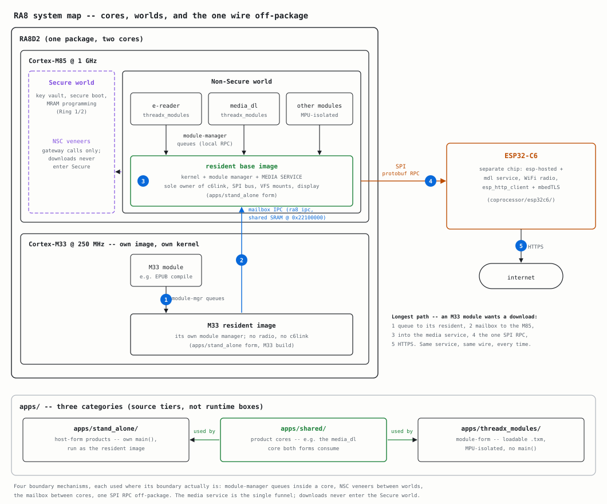

# ra8-firmware

[](https://github.com/bsikar/ra8-firmware/actions/workflows/firmware.yml)

A bare-metal firmware platform for the Renesas RA8 family (RA8D2 and RA8P1):
a hand-written HAL over the chip's register map, ports of the RTOS / USB /
networking / TLS stacks, and a host emulator that boots the real firmware
images so none of it needs a board. No Renesas FSP code lives here -- the FSP
sources and the Hardware User's Manual are reference material. Every
first-party line under `libs/` and `port/`, excluding the declared
`third_party/` SOUP roots, is written against the manual.

## Shape of the system



The three tiers are deliberate. `libs/`, `port/`, the emulator and the CI
machinery are the **platform** -- the reason the repo exists. `examples/` are
per-library demos that double as the hardware-in-the-loop vehicles. `apps/`
holds **proving products**, each structured as if it were its own repository
and consuming `libs/` the way an outside consumer would; `libs/` never imports
from `apps/`. Alongside them sit `tests/` (host unit tests, never
cross-compiled), `tools/`, `scripts/`, `infra/` (the declared CI fleet),
`coprocessor/` (ESP32-C6 companion firmware) and `docs/`.

## Running it

```sh
just apps::example::list        # list the firmware examples
just apps::build <app>          # cross-compile one, e.g. just apps::build blink
just apps::emulator::run <app>  # boot it on the emulator, no board
just tests::build               # host unit tests
```

`just` is the grouped target reference. It is derived from the justfiles,
so unlike a list written out here it cannot drift. On a fresh clone, install
the repository-local Python environment, hooks, exact Ansible collections, and
pinned CI image with `just setup`; it requires only Git, a standard-library
Python in the range declared by `pyproject.toml`, `just`, trusted CA certificates, and a
working Podman, Docker, or nerdctl runtime. Run `just dev-shell` afterward for
a writable shell containing the pinned ARM compiler, host compilers, CMake,
formatters, analyzers, and documentation tools; none are installed into the
host's system Python or package directories.

## The emulator

[`tools/ra8_emulator`](tools/ra8_emulator/README.md) boots the unmodified
cross-compiled `.elf` -- the same image that flashes to a board -- on an
emulated Cortex-M over a modelled RA8D2 peripheral space, and shows the GLCDC
framebuffer beside the board LEDs and live USB / UART / IRQ / touch state. The
live window is macOS-only (Cocoa, provisioned by `just apps::emulator::setup`); booting,
MMIO reporting, console capture and frame dumps run headless everywhere.

Because it runs the real binary through the real bring-up code, it reproduces
firmware bugs a short bench run never reaches. It models hardware *handshakes*
rather than silicon timing, and some peripherals are modelled further than
others, so it complements the bench instead of replacing it. CI leans on it:
`just apps::emulator::eil` boots every HIL app headless and asserts its expectation, and
`just apps::emulator::matrix` sweeps every example.

## Hardware

The bench board is an **EK-RA8D2**: Cortex-M85 at 1 GHz plus Cortex-M33 at
250 MHz, 1 MB MRAM, 1.6 MB ECC SRAM, 64 MB Octo-SPI flash and 64 MB SDRAM, a
7.0-inch 1024x600 parallel TFT, an OV5640 camera, and an on-board J-Link OB.
Flashing and debugging need the SEGGER J-Link tools.

Rig settings (probe serial, bench Pi) live in a gitignored `.env`; copy
`.env.example` and run `just hil::find_jlink` for the serial. The `just hil`
namespace drives the maintainer's bench rig and will not work elsewhere without
your own rig; run `just hil` to see every guarded operation.

**Bricked board?** `just hil::dlm_recover_local` asks for confirmation,
mass-erases an EK-RA8D2 cabled to this machine, and returns it to the factory
default (all-Secure, OEM_PL2). Run `just hil::dlm_check_local` first to
confirm the probe reaches it without changing the target.

## CI

Every gate body lives once, in `scripts/ci.sh`, and each workflow step is a thin
`just quality::local::gate <name>` driver, so local and CI cannot run different
checks. `just ci` runs them all in the pinned devcontainer; `just quality::native` is
the same set without a container runtime, which is the supported path on Linux.

## Docs

[`docs/`](docs/) is the reference shelf. Start at
[`docs/ARCHITECTURE.md`](docs/ARCHITECTURE.md) for how the firmware is put
together and [`docs/STYLE_GUIDE.md`](docs/STYLE_GUIDE.md) for the rules every
file is held to; [`docs/RING_AND_WORLD.md`](docs/RING_AND_WORLD.md) explains the
architectural rings and TrustZone worlds each file is tagged with.
[`CONTRIBUTING.md`](CONTRIBUTING.md) is how to land a change, and
[`docs/reference/`](docs/reference/) holds the datasheet and the Hardware User's
Manual that every register access in this tree cites.

## Tracker

The [issues](https://github.com/bsikar/ra8-firmware/issues) are the public
record. A private project board sorts them into lanes on top; if the board link
does not open for you, nothing is hidden -- the `priority:`, `epic:`, `area:`
and `needs-bench` labels carry the same information.

## License

MIT. See [`LICENSE.txt`](LICENSE.txt).
