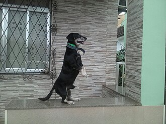
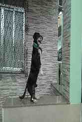
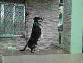

# Image Pyramid

`image_pyramid` deliberately makes a JPEG look worse at every level. Odd levels
remove every other column and even levels remove every other row, without
filtering. The app encodes the compacted pixels at JPEG quality 25, then decodes
that file before making the next level. This is a software version of physically
shredding a photograph and pushing the retained strips together.

The host app uses the repository's `ra8_jpeg_sw_decode()` and
`ra8_jpeg_sw_encode()` implementations. It does not use PPM, a platform image
codec, or a third-party JPEG API.

## Run it

```sh
just apps::host::build image_pyramid
mkdir -p output
just apps::host::run image_pyramid args="apps/host/image_pyramid/fixtures/dog-source.jpg --out-dir output"
```

Run these commands from the repository root. The default command writes eight
baseline JPEG files. `--levels N` selects 1 through 16 levels when the source
dimensions permit them. Each result has a name such as
level-01-165x247-q25.jpg, and every generated JPEG is decoded before the next
level is produced so its quality loss compounds. The command refuses existing
final or temporary output names and removes files it published if processing
later fails. The output directory must not be modified concurrently.

Use `--levels N` to choose how many files are produced:

```sh
mkdir -p output-one-level
just apps::host::run image_pyramid args="apps/host/image_pyramid/fixtures/dog-source.jpg --out-dir output-one-level --levels 1"
```

## Before and after

All three images below are tracked in the repository. Level 1 removes alternating
columns, so it becomes narrower. Level 2 starts from the decoded level-1 JPEG and
removes alternating rows, restoring approximately the source aspect ratio. Both
levels are encoded as quality-25 JPEGs, so compression damage also compounds.

| Before: source JPEG | Level 1: columns removed, 165x247 | Level 2: rows removed, 165x124 |
| --- | --- | --- |
|  |  |  |

Run the Zig test gate after changing the implementation or the tracked result:

```sh
just quality::devcontainer::test-zig
```

This is an intentional degradation demonstration, not a production-quality
image resizer: it performs no interpolation, averaging, or filtering.

SPDX-License-Identifier: MIT
Copyright (c) 2026 Brighton Sikarskie
