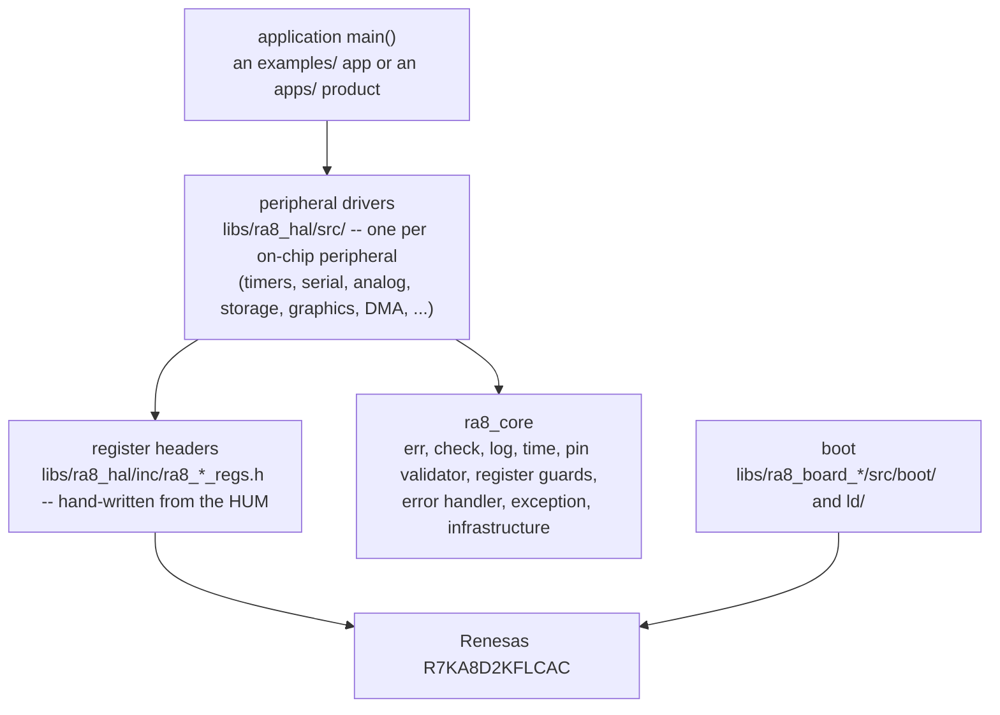
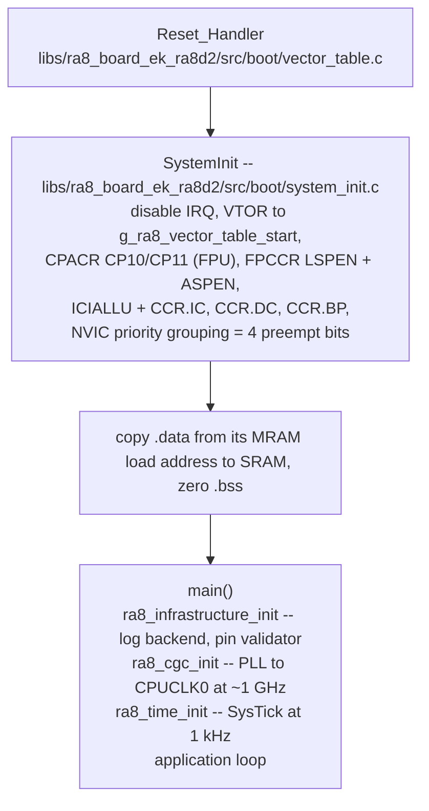

# ra8-firmware architecture

How the firmware is put together, from reset vector to `main()`.

## Layers



`ra8_core` has no hardware dependencies and compiles on host and target with the
same flags. `ra8_hal` is the only layer that dereferences a peripheral address.
A driver is a register header plus `ra8_core`'s utilities -- error codes, the
pin validator, logging, IRQ-masked critical sections.

## How it runs

The layer diagram above is the dependency stack. This is the same firmware seen as a
running system -- two cores, two TrustZone worlds, a companion radio, and the four
boundary mechanisms that carry traffic between them.


## Where code lives

```
examples/ek_ra8d2/<tier>/.../<app>/ one RA8D2 example per directory
apps/board/stand_alone/<product>/ a proving product, structured as its own repo
  apps/board/stand_alone/<product>/src/main.c application entry
  apps/board/stand_alone/<product>/src/*.c    app-private implementations
  app-local headers belong in a root-level directory named inc
  CMakeLists.txt                   thin declaration that calls ra8_add_app()
  linker_script.ld                 optional app-local memory-map override
  README.md, configs, assets       non-source artifacts stay at the unit root

libs/ra8_board_<board>/            default boot files and linker script
  libs/ra8_board_<board>/src/boot/*.c
  libs/ra8_board_<board>/ld/linker_script.ld

libs/                         the standard library -- see libs/README.md
```

Bare-metal has no `crt0.o` shipped by the toolchain, so the board layer *is*
`crt0.o`: it provides the vector table pinned to MRAM, the `.data` copy and
`.bss` zero, and a `SystemInit()` that has already set VTOR, the FPU enables and
NVIC priority grouping by the time `main()` runs. That is why an app is usually
one file. Dropping a same-named boot file into the app's `src/` directory
overrides the board copy for that app alone; an app-root `linker_script.ld`
overrides the default memory map. Divergent startup is supported, but is not
the default.

### The build

The top-level `CMakeLists.txt` discovers every selected app through
`scripts/dev/ra8_apps.py`; each app has a main source under its `src`
directory and a root CMake declaration. All the logic is in one shared recipe,
`cmake/ra8_add_app.cmake`, so the per-app file only names the app:

```cmake
ra8_add_app(
    NAME blink
    STACK_BYTES 2200
    DESCRIPTION "Bare-metal blink firmware for RA8D2"
)
```

`ra8_add_app()` links the selected app's sources, the boot files, and the linker script
(the app-local copy if present, else the board's) and the `ra8_*` libraries,
`ra8_secure_app` among them. Its remaining options -- which board, which extra
libraries, whether the app skips the NSC layer -- are documented in that
file's header.
Adding an app is dropping the directory in; the next `just build_all` finds it.

## Boot



## Error handling

Every fallible function returns `ra8_err_t`: `k_ra8_ok` means the
post-conditions hold, and any other `k_ra8_err_*` is the caller's to handle.
Propagation goes through `ra8_check.h`:

| Macro | For |
|---|---|
| `RA8_CHECK_NULL_PTR(ptr, tag, msg)` | rejecting NULL at entry |
| `RA8_RETURN_ON_ERROR(err, tag, msg)` | propagating up the call stack |
| `RA8_ERROR_CHECK(err)` | halting on a fatal error -- init paths only |
| `RA8_ASSERT(cond, msg)` | programmer errors, never runtime conditions |

A fault that makes the system unsafe goes to `ra8_fatal_error()`, which masks
interrupts, logs, `BKPT #0`s to stop an attached debugger, and spins in `WFI`.
CPU exceptions go further: each of the four synchronous faults has a naked
trampoline that captures the stacked exception frame and exception number and
forwards to `ra8_exception_report()` for a full SCB dump.

## Dependency injection

`ra8_core` defines the vtables a driver injects through --
`ra8_pin_interface_t`, `ra8_time_interface_t` and `ra8_error_interface_t`,
with production instances
`g_ra8_gpio_pin_interface`, `g_ra8_time_interface_systick` and
`g_ra8_error_sink_log`. A driver that wants to be unit-testable takes them in
its `init()` config and calls through the vtable rather than reaching for a
global; tests plug in mocks that record every call.

## Clock tree after `ra8_cgc_init()`

The 24 MHz main crystal feeds PLL1 (integer multiply only -- the PLLCCR2
fractional path is unimplemented) to give CPUCLK0 at ~1 GHz for the Cortex-M85,
and from there:

| Divider | Clock | Rate |
|---|---|---|
| /4 | ICLK, PCKD, PCKE, MRICLK | 250 MHz |
| /8 | PCKA, PCKC, FCLK, BCLK | 125 MHz |
| /16 | PCKB | 62.5 MHz |

Drivers read the live value from `ra8_cgc_get_clock_hz()` rather than
hard-coding `k_ra8_pclkb_hz` -- the constants in `ra8_time_constants.h` are the
bring-up *targets*, not a promise about the running system.

## Freestanding Runtime & Memory Architecture

Target firmware is fully freestanding (`-ffreestanding -nostdlib`). The project owns its entire startup and runtime environment:

- **Startup & Bootstrap**: The project owns `Reset_Handler`, the vector table, `SystemInit`, cache/MPU setup, `.data` section relocation from MRAM to SRAM, and `.bss` zeroing. Normal newlib C runtime startup (`crt0`, `crtbegin`, `crtend`) is neither used nor linked.
- **Zero-Heap / NASA Power of 10 Rule 3**: No general-purpose heap exists. Target images omit linker symbols `end` and `_end` and declare no `.heap` section. Standard allocators (`malloc`, `calloc`, `realloc`, `free`, `reallocarray`, `strdup`, `asprintf`) are forbidden and unavailable on the target. Any accidental call fails at link time with an unresolved reference.
- **Approved Allocation Models**: Bounded, deterministic allocation is permitted through ThreadX byte pools (`TX_BYTE_POOL`), ThreadX block pools (`TX_BLOCK_POOL`), NetX packet pools, caller-owned arenas, and bounded static workspaces.
- **Freestanding C Runtime Primitives**: The compiler-required C ABI primitives are implemented directly in `libs/ra8_core/` without libc:
  - Memory: `memset`, `memcpy`, `memmove`, `memcmp`, `memchr` (`ra8_freestanding_mem.c`).
  - String: `strlen`, `strnlen`, `strcmp`, `strncmp`, `strchr`, `strrchr`, `strstr`, `strcpy`, `strncpy` (`ra8_freestanding_str.c`).
  - Integer Math: `abs` (`ra8_freestanding_math.c`).
  - Compiler-emitted calls to `memset` and `memcpy` resolve strictly to project-owned objects.
- **External Library Policy**:
  - `newlib` and `newlib-nano` (`libg_nano.a`, `libc_nano.a`, `libc.a`): forbidden in target firmware.
  - `libnosys` (`libnosys.a`, including its unbounded bump-`sbrk`): forbidden.
  - `libgcc` (`libgcc.a`): approved compiler runtime support (`__aeabi_*` division and floating-point helpers).
  - `libm` (`libm.a`): approved compiler math runtime (transcendental functions), explicitly gated to the 26-member allowlist in `_allowed_libm_members()` of `check_freestanding_runtime.py` to prevent introduction of `malloc`/`stdio`.
  - First-party archives (`libthreadx.a`, `libthreadx_ns.a`, `libra8_shared_ek_ra8d2.a`): approved project-domain build products, gated by `_allowed_project_archives()`.
  - Any other live archive member fails closed: trust is never inferred from toolchain path substrings. Extracted-but-discarded and LOAD-only mentions are not live and do not fail.
- **Invariants & Assertions**:
  - `static_assert(condition, message)`: compile-time assertions.
  - `RA8_ASSERT(condition, message)`: runtime programmer invariants (logs via `ra8_log` and halts via `ra8_fatal_error`).
  - Standard `assert(...)` from `<assert.h>` is forbidden in target code (it pulls in `__assert_func`, standard I/O streams, and allocator internals).
- **Enforcement & Gating**:
  - Source checks alone are insufficient; post-link binary and ELF/map verification is mandatory.
  - `scripts/checks/check_no_dynamic_alloc.py` enforces source-level bans on direct allocators across firmware and production code.
  - `scripts/checks/check_freestanding_runtime.py` verifies target ELFs and map files for zero newlib/libnosys members, absence of heap anchors, absence of `.heap` sections, reviewed runtime ABI allowlists, and proper symbol provider resolution.
