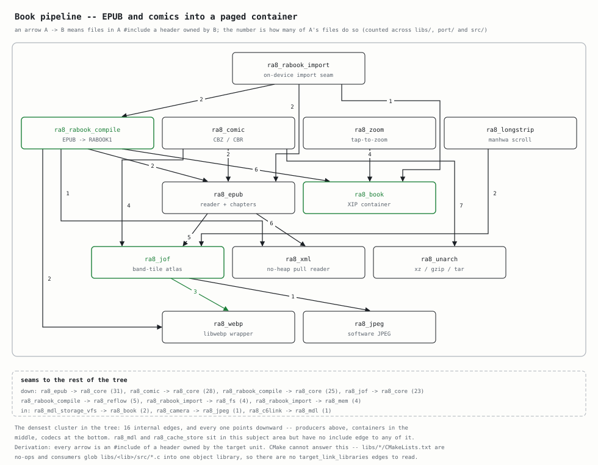

# EPUB Reader -- Supported Conformance Subset

> Ratifies issue #70 (part of the e-reader roadmap #69). This is the **contract**
> the on-device EPUB reader implements: what it accepts, what it renders, and --
> for everything it does not support -- the **defined** degradation it falls back
> to. There is no undefined behavior: every unsupported feature is skipped,
> placeholdered, or rejected with a message.

The reader is a grayscale e-ink reading device (Kindle / Kobo class). It is **not**
a web browser: there is no runtime DOM, no JavaScript, no media. Rendering is a
zero-allocation, bounded, MC/DC-testable text-flow engine (`libs/ra8_reflow`) fed
by a zero-heap EPUB container parser (`libs/ra8_epub`).

---

## 1. Container / package surface (accepted)

Parsed by `libs/ra8_epub` (miniz for ZIP and the caller-owned bounded pure-C
reader for XML), zero-heap:

| Surface | Support |
|---------|---------|
| ZIP (OCF) container, stored + DEFLATE | Yes (miniz, inline `mz_zip_archive`) |
| `META-INF/container.xml` -> rootfile | Yes |
| OPF: `<manifest>`, `<spine>`, Dublin Core `<metadata>` | Yes |
| Spine reading order + linear items | Yes |
| Cover image reference (manifest `properties="cover-image"` / OPF `<meta name="cover">`) | Yes (bytes extracted) |
| Navigation: NCX (`toc.ncx`) and EPUB 3 nav document | Both (#74) |
| Chapter (spine item) extraction to a byte buffer | Yes |

**Must-accept reality.** The reader targets **EPUB 2.0.1** and **loosely-conformant
EPUB 3** -- i.e. most real-world books, which are frequently not strictly valid.
A spine item that fails to parse degrades to a one-line "chapter could not be
opened" page; it never aborts the book.

---

## 2. XHTML element subset (rendered)

The `ra8_reflow` v1 tokenizer recognizes the tags below
(`libs/ra8_reflow/src/ra8_reflow_tokenize_lex.c`). This list is the **ratified element
contract**:

- **Block:** `
`, `<h1>`..`<h6>`, `<blockquote>`, `<ul>`, `<ol>`, `<li>`, `
`.
- **Inline:** `<em>`, `<strong>`, `<b>`, `<i>`, `<a>`, ` `.
- **Replaced:** `` -- laid out as a placeholder rectangle (in-content image
  decode is deferred; see section 5).

**Unknown elements are transparent flow-through.** Any tag not in the list above
(`
`, ``, `<section>`, `<table>`, `<figure>`, ...) contributes **no**
box or styling, but its **children still lay out**. This is deliberate: it means
an unrecognized wrapper never hides its text. Tag *attributes* other than `<a
href>` are ignored.

Entities: the standard XML/XHTML named + numeric character references resolve to
their code points; unresolved references pass through verbatim.

---

## 3. CSS posture

**v1 ignores CSS.** Author and user stylesheets, `style=""` attributes, and
`<style>` blocks are flow-through (no styling applied). The supported styling
surface is exactly:

1. The intrinsic block/inline/heading layout `ra8_reflow` applies by tag.
2. The **minimal authored box-model** that the application *chrome* uses --
   padding/margin, background fill, border, a constrained flex/grid, absolute
   placement -- added under #76/#80. That subset is bounded and MC/DC-able
   **because the chrome markup is authored in-tree**, so only the properties
   actually used are implemented.

**litehtml stays benched.** A litehtml-backed `v2` exists behind
`RA8_REFLOW_USE_LITEHTML` (default **OFF**). litehtml brings the full CSS box
model but pulls C++/STL + `malloc` (violates NASA P10 Rule 3) and ~215 SOUP
files onto the content path. It is the **content-only** escape hatch: if a real
EPUB 3 corpus visibly defeats v1's text-flow model (tables, floats, embedded
fonts), the flag may be flipped for **book content rendering only -- never for
chrome** (see `docs/SOUP/litehtml.md` and #76). The boundary is explicit: chrome
is always v1.

---

## 4. Explicitly NOT supported -- with defined degradation

Each unsupported feature has one defined behavior. None is undefined.

| Feature | Behavior |
|---------|----------|
| JavaScript (`<script>`, event handlers) | **Skip.** Script content is not executed and not rendered. |
| CSS (author/user/inline) in v1 | **Ignore.** See section 3. |
| MathML | **Skip element, keep text.** The `<math>` subtree lays out as flow-through text; no formula rendering. |
| SVG (`<svg>`, standalone) | **Placeholder rectangle**, same as ``. No vector rendering. |
| Raster images in book content | **Placeholder rectangle** (decode deferred -- section 5). |
| SMIL / Media Overlays | **Skip.** Text renders silently; no read-aloud sync. |
| Audio / video (`<audio>`, `<video>`) | **Skip element.** No media playback on the device. |
| Fixed-layout rendition (`rendition:layout="pre-paginated"`) | **Reflow anyway.** The reader paginates the XHTML as reflowable text; fixed coordinates are ignored. |
| Remote resources (`http(s)://` hrefs/srcs) | **Reject the resource.** No network fetch; an `` placeholder or a dead `<a>` results. |
| Encrypted / DRM content (`META-INF/encryption.xml`) | **Reject the book** with a "protected book not supported" message. |
| Embedded fonts (`@font-face`) | **Ignore.** Text renders in the device font (`libs/ra8_sdfont` / stb_truetype). |

---

## 5. Image formats

- **Cover image:** the raw bytes are extracted by `ra8_epub_get_cover_image()`
  and decoded by the caller via stb_image for the library / book-open screen.
- **In-content images:** **not decoded yet** -- laid out as a placeholder
  rectangle so surrounding text flows correctly. Wiring in-content decode
  (reusing the cover decoder) is a tracked gap, not part of this contract.

---

## 6. Where this contract lives in code

| Contract clause | Source of truth |
|-----------------|-----------------|
| Container / package | `libs/ra8_epub/` |
| Element subset + flow-through | `libs/ra8_reflow/src/ra8_reflow_tokenize_lex.c` (tag table) |
| Block/heading/inline layout | `libs/ra8_reflow/src/ra8_reflow_layout.c` |
| CSS off by default | `RA8_REFLOW_USE_LITEHTML` (CMake option, default OFF) |
| litehtml content-only scope | `docs/SOUP/litehtml.md` |

Changes to the accepted element set or a degradation behavior must update this
document in the same change.

The libraries this contract is implemented across, and how they couple:

