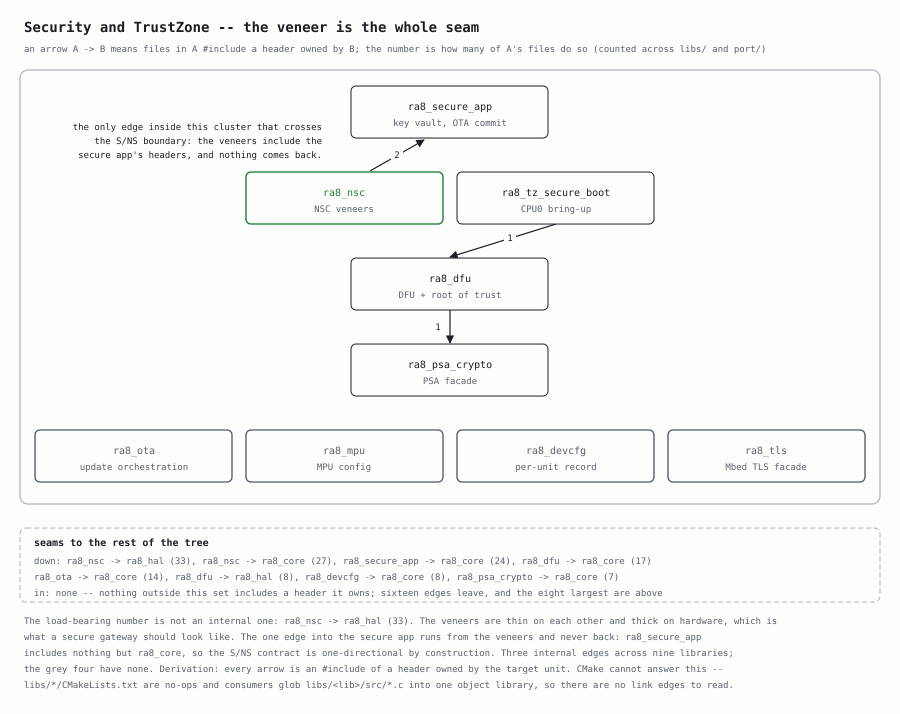

# Root-of-Trust Signing Key

The root-of-trust (RoT) signing key is the single anchor of the secure-boot
chain: `tools/rot_sign.py sign` signs every launched image with the **private**
key, and the device trusts only images that verify against the **public** key
provisioned into `libs/ra8_dfu/src/ra8_rot.c` (`s_rot_root_pubkey`). Lose the
private key and no new image can be signed for the provisioned public key -- you
must re-key and re-flash.

The key is a NIST P-256 (ECDSA) keypair. The private key **never** enters git;
it lives at `~/ra8d2-rot-signing-key.pem` (0600) and, for durability + history,
in a key store (below).

## Key store: two backends

`scripts/secrets/rot_keystore.py` keeps a **versioned, tagged history** of every RoT key
so you can create new credentials whenever you want and still recover any prior
key. It picks a backend automatically (override with `--backend`):

| Backend | What it is | For whom |
|---------|-----------|----------|
| `openbao` | The team OpenBao server you already run (the k3s pod at `BAO_ADDR`), KV v2 with native versioning. Reached over HTTP by `scripts/secrets/openbao_client.py` -- **nothing is spun up locally**. | Maintainers with vault access. |
| `local` | A 0700 directory (`RA8_ROT_STORE_DIR`, default `~/.config/ra8/rot`) holding one PEM per version plus `history.json`. | Anyone who clones the repo -- **no OpenBao needed**, same spirit as the `.env` fallback. |

`auto` uses OpenBao when it is configured **and** reachable, else falls back to
the local store. Every stored version is tagged with: `fingerprint` (SHA-256 of
the public SPKI), `algorithm`, `created_at` (UTC), `git_commit`, and a `note`.

## OpenBao configuration

The vault address + AppRole identity come from the same 0600 creds file the HIL
tooling uses -- `~/.config/hil/openbao.env` (override with `HIL_OPENBAO_ENV`);
it holds how to reach the vault, never the secrets themselves. See
`scripts/secrets/openbao_client.py` for the full key list. The RoT-specific path is
`BAO_ROT_SECRET_PATH` (default `ra8d2/rot-signing-key`) under `BAO_KV_MOUNT`.

The AppRole policy must allow `create`/`update`/`read` on
`<mount>/data/ra8d2/rot-signing-key` and `<mount>/metadata/ra8d2/rot-signing-key`.

## Common operations

```sh
# First-time ceremony: generate a key, provision the pubkey, and store it.
scripts/secrets/rot_provision.sh --patch --store

# Store an existing working key as a new version.
scripts/secrets/rot_keystore.py store --key ~/ra8d2-rot-signing-key.pem

# See every version and its tags.
scripts/secrets/rot_keystore.py history

# Which backend is active + the latest version.
scripts/secrets/rot_keystore.py status

# Recover a specific version's private key.
scripts/secrets/rot_keystore.py get --version 2 --out /tmp/rot-v2.pem

# Re-key: back up the outgoing key, generate + tag a new one, provision it,
# and install it as the working key. Then re-flash the device.
scripts/secrets/rot_keystore.py rekey --patch --note "annual rotation"

# Force the no-vault path (e.g. for a fresh clone with no OpenBao access).
scripts/secrets/rot_keystore.py --backend local status
```

`rekey` never loses a key: it stores the outgoing working key first, so the
history always contains every key you have ever used.

## Signing an image

```sh
python3 tools/rot_sign.py sign --key ~/ra8d2-rot-signing-key.pem \
  --image app.bin --out app.signed.bin --img-version N
```

Where this sits in the security cluster, and what it couples to:


