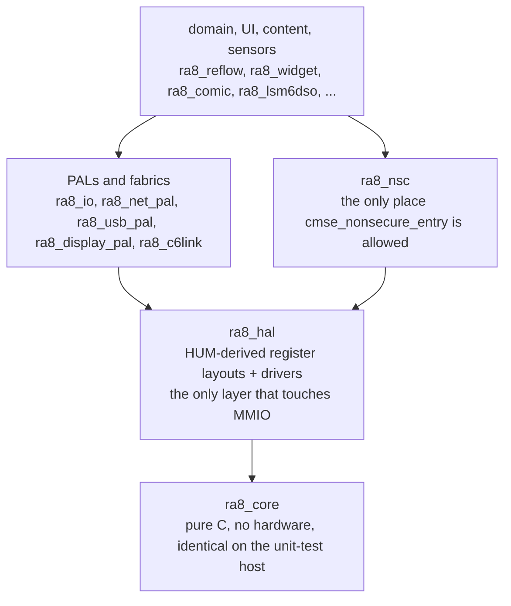

# libs/

The project's standard library: hand-written, first-party C, one directory per
library. `ra8_` is the C symbol namespace, not a directory-naming habit -- a
directory `ra8_foo/` owns the `ra8_foo_*` functions and types and the
`k_ra8_foo_*` enum values, per [`docs/STYLE_GUIDE.md`](../docs/STYLE_GUIDE.md).

Two directories are exempt from the coding-style rules. `third_party/` is
vendored SOUP (Software of Unknown Provenance) and keeps its upstream
conventions; its component justifications live under [`docs/SOUP/`](../docs/SOUP/)
and MC/DC re-test is waived there. `ra8_fonts/` carries the prefix because it
owns the `g_ra8_font_*` blob symbols, but it is font data plus a generated
header, not hand-authored code.

## Layering

Code may depend on anything lower, never on anything higher. The bottom edge is
enforced: `scripts/checks/check_core_layering.py` fails the build if anything
under `ra8_core` includes a header owned by another library. Full ring numbering
and the `{World: S/NS/NSC}` TrustZone tag every Ring-3+ file carries are in
[`docs/RING_AND_WORLD.md`](../docs/RING_AND_WORLD.md).

## Coupling maps

Who actually includes whom, derived from the `#include` edges between `libs/`, `port/`
and `src/` -- not from the CMake graph, which cannot answer it (every
`libs/*/CMakeLists.txt` is a no-op and consumers glob the sources into one object
library). The number on each arrow is how many files carry that edge.

- [I/O fabric](../docs/diagrams/io_fabric.svg) -- `ra8_io` and the adapters above it, down to `ra8_fs` and the SD driver.
- [Book pipeline](../docs/diagrams/book_pipeline.svg) -- EPUB and comics into a paged container -- the densest cluster in the tree.
- [Display and render](../docs/diagrams/display_render.svg) -- The widget/reflow stack, and the display PAL that shares no edge with it.
- [Networking](../docs/diagrams/networking.svg) -- Everything converging on `ra8_c6link`, the one boundary to the radio.
- [Memory hierarchy](../docs/diagrams/memory_hierarchy.svg) -- Arenas and caches, and the libraries that reach for them.
- [Security and TrustZone](../docs/diagrams/security_tz.svg) -- The NSC veneers, the secure app, and the DFU/root-of-trust chain.
- [Audio and camera](../docs/diagrams/audio_camera.svg) -- Sparse on purpose: the transports arrive as injected vtables.

The whole system, cores and all, is in
[`docs/diagrams/system_map.svg`](../docs/diagrams/system_map.svg).

## The libraries

`ls libs/` is the registry; the grouping below is a reading aid, and each
library's own file-header `@par Tag` is authoritative for its ring and world.

**Foundation and hardware**

| | |
|---|---|
| [`ra8_core/`](ra8_core/) | `ra8_err`, `ra8_log`, `ra8_check`, `ra8_time`, pin validator, register-protection guards, fault handlers. |
| [`ra8_hal/`](ra8_hal/) | Register headers derived from the Hardware User's Manual, plus every RA8D2 peripheral driver. |
| [`ra8_mpu/`](ra8_mpu/) | Cortex-M85 MPU configuration. |
| [`ra8_nsc/`](ra8_nsc/) | TrustZone Non-Secure-Callable veneers. |
| [`ra8_tz_secure_boot/`](ra8_tz_secure_boot/) | TrustZone secure-boot bring-up for CPU0. |
| [`ra8_board_ek_ra8d2/`](ra8_board_ek_ra8d2/) | EK-RA8D2 v1 board support -- owns the pinout. |
| [`ra8_board_ra8p1/`](ra8_board_ra8p1/) | RA8P1 board support. |
| [`ra8_devcfg/`](ra8_devcfg/) | Per-unit configuration record: schema, storage seam, two-copy resolution. |

**I/O, storage and networking**

| | |
|---|---|
| [`ra8_io/`](ra8_io/README.md) | The peripheral-agnostic I/O fabric: block-device, SPI and I2C vtables, streams, VFS, pluggable filesystem formats, caches. |
| [`if_ra8_vfs/`](if_ra8_vfs/) | Firmware filesystem-port adapter over `ra8_io_vfs` and `ra8_fs`. |
| [`ra8_fs/`](ra8_fs/README.md) | FAT12/16/32 and exFAT adapter (read + write). |
| [`ra8_ftl/`](ra8_ftl/README.md) | Flash translation layer -- free overwrite over erase-before-write media. |
| [`ra8_sdmmc_spi/`](ra8_sdmmc_spi/) | SD cards in SPI mode. |
| [`ra8_net_pal/`](ra8_net_pal/) | Ethernet PAL below an external IP stack. |
| [`ra8_usb_pal/`](ra8_usb_pal/) | USB device-mode PAL below an external USB stack. |
| [`ra8_display_pal/`](ra8_display_pal/) | Display PAL spanning LCD (GLCDC) and e-paper backends. |
| [`ra8_c6link/`](ra8_c6link/README.md) | The one boundary to the ESP32-C6 companion radio: esp-hosted framing, envelope, protobuf RPC. |
| [`ra8_wifi/`](ra8_wifi/README.md) | Uniform Wi-Fi facade: init, connect, get an IP, disconnect. |
| [`ra8_modem_at/`](ra8_modem_at/) | Cellular modem AT command/response driver over UART. |
| [`ra8_tls/`](ra8_tls/) | Facade over the vendored Mbed TLS. |
| [`ra8_psa_crypto/`](ra8_psa_crypto/) | PSA Crypto facade over tf-psa-crypto. |

**Memory**

| | |
|---|---|
| [`ra8_mem/`](ra8_mem/) | Zero-heap primitives: bump arenas, slabs, glyph atlas, key cache, virtual-memory and tile caches, `vsource` read-only views. |
| [`ra8_cache_store/`](ra8_cache_store/) | Persistent CRC32-keyed blob cache for compiled `.rabook` containers. |

**Content pipeline**

| | |
|---|---|
| [`ra8_gfx/`](ra8_gfx/) | Software 2D primitives over a caller-owned framebuffer. |
| [`ra8_reflow/`](ra8_reflow/) | HTML/CSS reflow and pagination. |
| [`ra8_xml/`](ra8_xml/) | Bounded no-heap XML pull reader. |
| [`ra8_epub/`](ra8_epub/) | EPUB reader and chapter iterator. |
| [`ra8_book/`](ra8_book/) | Execute-in-place container for a compiled e-book. |
| [`ra8_rabook_compile/`](ra8_rabook_compile/) | EPUB to RABOOK1 compile pipeline. |
| [`ra8_rabook_import/`](ra8_rabook_import/) | Binds the on-device import seam to the RABOOK compiler. |
| [`ra8_mdl/`](ra8_mdl/) | Shared media-artifact format contract for download and export paths. |
| [`ra8_mdl_storage_vfs/`](ra8_mdl_storage_vfs/README.md) | No-heap RBKC validator and reader over named VFS mounts. |
| [`ra8_comic/`](ra8_comic/) | Demand-paged CBZ/CBR reader. |
| [`ra8_longstrip/`](ra8_longstrip/) | Continuous vertical-scroll (manhwa) mode. |
| [`ra8_zoom/`](ra8_zoom/) | Tap-to-zoom viewport state machine and strip composite. |
| [`ra8_jof/`](ra8_jof/) | JOF band-tile atlas -- the display-native image format. |
| [`ra8_jpeg/`](ra8_jpeg/) | Pure-software baseline JPEG codec. |
| [`ra8_webp/`](ra8_webp/) | Heap-free scratch-allocator wrapper around vendored libwebp. |
| [`ra8_unarch/`](ra8_unarch/) | Bounded fail-closed XZ/LZMA2, gzip and tar decoding. |
| [`ra8_sdfont/`](ra8_sdfont/) | Loads a TTF/OTF font off an SD card, self-provisioning if absent. |

**UI**

| | |
|---|---|
| [`ra8_ui/`](ra8_ui/) | Interaction core: hit-testing, screen stack, paging. |
| [`ra8_widget/`](ra8_widget/) | Widget tree -- toolbar, nav bar, status bar, book and reflow views. |
| [`ra8_box/`](ra8_box/) | Allocation-free box-model layout. |
| [`ra8_keyboard/`](ra8_keyboard/) | On-screen keyboard. |
| [`ra8_app/`](ra8_app/) | Zero-heap application framework: lifecycle, static registry, launcher. |

**Capture and sensors**

| | |
|---|---|
| [`ra8_camera/`](ra8_camera/) | Transport-neutral camera source and image-codec facade. |
| [`ra8_camera_io/`](ra8_camera_io/) | Bridges encoded camera frames to `ra8_io_stream` sinks. |
| [`ra8_ov5640/`](ra8_ov5640/) | OmniVision OV5640 sensor driver. |
| [`ra8_audio/`](ra8_audio/) | Caller-owned audio capture facade. |
| [`ra8_lsm6dso/`](ra8_lsm6dso/) | ST LSM6DSO 6-DoF IMU. |
| [`ra8_touch_cal/`](ra8_touch_cal/) | Touch-screen calibration. |
| [`ra8_epd_cal/`](ra8_epd_cal/) | Per-device e-paper VCOM calibration and its storage seam. |

**System services**

| | |
|---|---|
| [`ra8_dfu/`](ra8_dfu/) | USB-DFU MRAM bootloader core, plus host-side DFU and root-of-trust helpers. |
| [`ra8_ota/`](ra8_ota/README.md) | OTA firmware-update orchestration. |
| [`ra8_wdt_supervisor/`](ra8_wdt_supervisor/) | Watchdog supervisor with a per-thread check-in registry. |
| [`ra8_batt/`](ra8_batt/) | Allocation-free low-battery nag policy. |
| [`ra8_power_profile/`](ra8_power_profile/) | Power-profiling helper. |

## Adding one

A new top-level directory is warranted when the code is a genuinely new library
boundary -- its own symbol namespace, its own ring and world, and a reason no
existing library should absorb it. Hardware-specific code with nothing new
architecturally is a HAL driver: add files under `ra8_hal/`. When you do add
one, tag every file's header per
[`docs/RING_AND_WORLD.md`](../docs/RING_AND_WORLD.md), give every exported
symbol the `ra8_foo_*` naming, and add a row above. Never write a running total
of libraries anywhere in this file -- it rots the day the next one lands.
