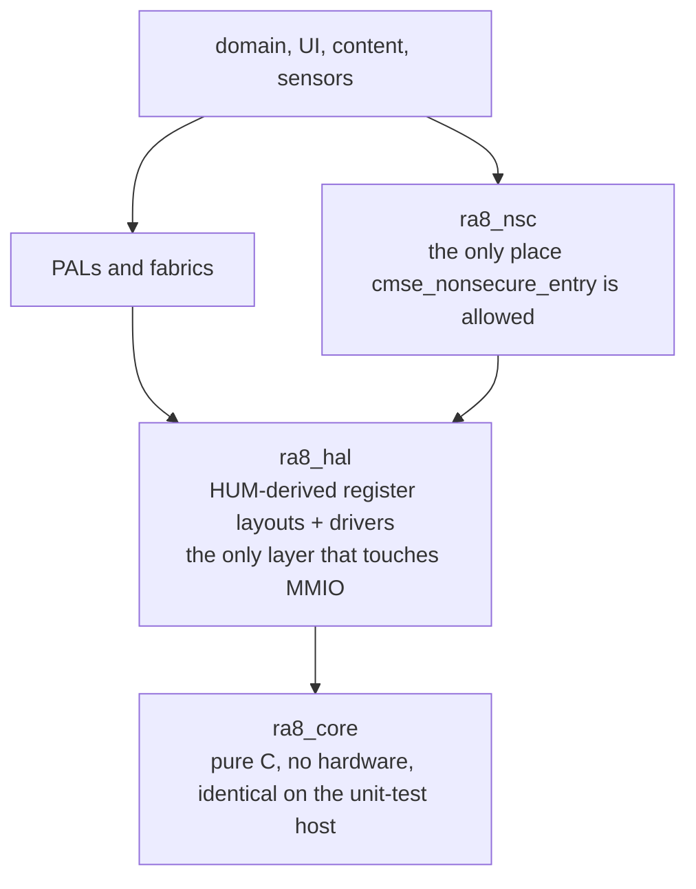

# libs/

The project's standard library: hand-written, first-party C, one directory per
library. `ra8_` is the C symbol namespace, not a directory-naming habit -- a
directory `ra8_foo/` owns the `ra8_foo_*` functions and types and the
`k_ra8_foo_*` enum values, per [`docs/STYLE_GUIDE.md`](../docs/STYLE_GUIDE.md).
`ls libs/` is the registry; nothing in this file restates it.

Two directories are exempt from the coding-style rules. `third_party/` is
vendored SOUP (Software of Unknown Provenance) and keeps its upstream
conventions; its component justifications live under
[`docs/SOUP/`](../docs/SOUP/) and MC/DC re-test is waived there. `ra8_fonts/`
carries the prefix because it owns the font blob symbols, but it is data plus a
generated header, not hand-authored code.

## Layering

Code may depend on anything lower, never on anything higher. The bottom edge is
enforced: `scripts/checks/check_core_layering.py` fails the build if anything
under `ra8_core` includes a header owned by another library. Full ring numbering
and the `{World: S/NS/NSC}` TrustZone tag every Ring-3+ file carries are in
[`docs/RING_AND_WORLD.md`](../docs/RING_AND_WORLD.md).

## The families above the HAL

A library's own file-header `@par Tag` is authoritative for its ring and world.
The grouping below is a reading aid for someone opening `ls libs/` for the
first time.

- **Foundation and hardware.** Error codes, logging, time, the pin validator
  and the fault handlers; the register headers derived from the Hardware User's
  Manual and every peripheral driver over them; the MPU, the TrustZone veneers
  and secure boot; and one board-support directory per target board, which owns
  that board's pinout so no app hand-encodes a pin.
- **I/O, storage and networking.** A peripheral-agnostic I/O fabric that
  everything storage-shaped goes through, the filesystem and flash-translation
  layers under it, platform abstraction layers below the vendored Ethernet, USB
  and display stacks, and a single boundary library to the companion radio.
- **Memory.** Zero-heap arenas, slabs and caches. Nothing above them allocates.
- **Content pipeline.** Markup and image decoding, reflow and pagination, the
  compiled-book containers, and the comic and long-strip readers.
- **UI.** The interaction core, the widget tree, allocation-free box-model
  layout, and the application framework the shell is built from.
- **Capture and sensors.** Camera, audio and IMU facades, each with its
  concrete device driver behind an injected seam rather than compiled in.
- **System services.** The DFU bootloader core, OTA orchestration, the watchdog
  supervisor, and the power and battery policies.

## Coupling maps

Who actually includes whom, derived from the `#include` edges between `libs/`,
`port/` and `src/` -- not from the CMake graph, which cannot answer it (every
`libs/*/CMakeLists.txt` is a no-op and consumers glob the sources into one
object library). The number on each arrow is how many files carry that edge.

- [I/O fabric](../docs/diagrams/io_fabric.svg) -- `ra8_io` and the adapters above it, down to `ra8_fs` and the SD driver.
- [Book pipeline](../docs/diagrams/book_pipeline.svg) -- EPUB and comics into a paged container; the densest cluster in the tree.
- [Display and render](../docs/diagrams/display_render.svg) -- The widget/reflow stack, and the display PAL that shares no edge with it.
- [Networking](../docs/diagrams/networking.svg) -- Everything converging on `ra8_c6link`, the one boundary to the radio.
- [Memory hierarchy](../docs/diagrams/memory_hierarchy.svg) -- Arenas and caches, and the libraries that reach for them.
- [Security and TrustZone](../docs/diagrams/security_tz.svg) -- The NSC veneers, the secure app, and the DFU/root-of-trust chain.
- [Audio and camera](../docs/diagrams/audio_camera.svg) -- Sparse on purpose: the transports arrive as injected vtables.

The whole system, cores and all, is in
[`docs/diagrams/system_map.svg`](../docs/diagrams/system_map.svg).

## Adding one

A new top-level directory is warranted when the code is a genuinely new library
boundary -- its own symbol namespace, its own ring and world, and a reason no
existing library should absorb it. Hardware-specific code with nothing new
architecturally is a HAL driver: add files under `ra8_hal/`. When you do add
one, tag every file's header per
[`docs/RING_AND_WORLD.md`](../docs/RING_AND_WORLD.md) and give every exported
symbol the `ra8_foo_*` naming. Do not add it to a list in this file, and never
write a running total of libraries anywhere -- both rot the day the next one
lands.
